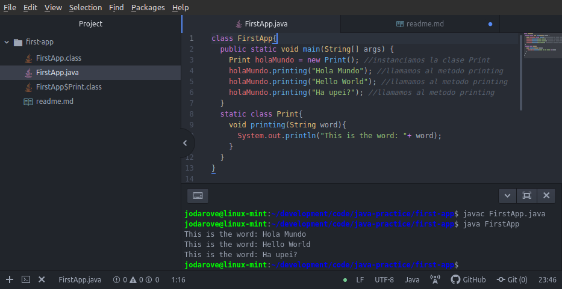

# Practicing and Playing with Java
To run this type in terminal: (I'm assuming that you have Java already installed.)
```
javac FirstApp.java

```
this would generate another file called FirstApp.class then you need to run that
```
java FirstApp
```
and all this should look like this.

